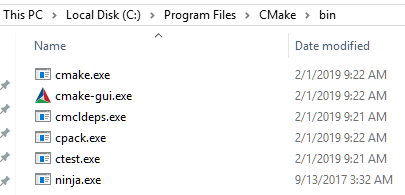

# Build system

Build automation is the process of automating the creation of a software package. In general it includes: compiling source code, running automated tests, and the creation of a installation package. Build-automation tools allow the automation of simple, repeatable tasks. When we use them we improve team efficiency and production as well as product quality. As a result of it we achieve faster product delivery. When we choose a build system we should take into consideration if we want:

- to support multiple compilers
- to use various IDEs,
- to support different OSs
- to use CI (continuous integration)  

 When the [build systems](https://en.wikipedia.org/wiki/List_of_build_automation_software) come into play we should be familiar with a notion of a [target](https://cmake.org/cmake/help/v3.13/manual/cmake-buildsystem.7.html). The build systems:construction_worker::construction_worker: organize files into targets. Each target corresponds to an executable or library, or is a custom target containing custom commands or actions the build tool must perform, such as installing an application.

## Cross-platform solution

As cross-platform programmers we need a simple build system which we can leverage on many platforms in the same way irrespective of IDE or toolchain we utilize. We use it to configure the build options and create the final applications or libraries from sources. That tasks developers have to repeat several times every day, so it is extremely important to ensure that the process is under control and repeatable.

## Powerful duo comes to rescue

Our project is growing. More and more modules come into play. That will be harder to do all things manually. We need automate a build process. It's about time we need to get familiar with the main actors of our story. Ladies and gentlemen let me introduce a fantastic couple:couple: [Cmake](https://cmake.org/) and [Ninja](https://ninja-build.org/). As we may expect these are command line tools too. It means we need run they from a shell. [Run your shell](https://en.wikipedia.org/wiki/Shell_\(computing\)) such a bash on Unix , cmd.exe or Msys2 shell on Windows. Now an operating system is at our command.  
Type **cmake \-\-version** and press Enter.
  
Type **cmake \-\-help** don't forget about **enter**, now  **cmake \-\-help-command-list** and **cmake \-\-help-manual-list**. I feel we got the hang of the first tool.  
Now Ninja. Type **ninja \-\-version** and press Enter.  
  
Before we delve into building processes, we have the opportunity to strut our stuff.  
  
Under construction stay tuned :smile:  
<!-- blank line -->
<figure class="video_container">
  <iframe src="https://www.youtube.com/embed/5A4k0q0KY1o" frameborder="0" allowfullscreen="true"> </iframe>
</figure>
<!-- blank line -->
