# Command Line

## Highway to Hell for a tough cookie

Our previous levels were a breeze, but from then on the story shifts gears. Get up on your feet we start grappling with basis of a command line. A wise deviser:construction_worker: have to understand the relation between components to solve problems of their domain and how the compilation pipeline looks like. The grasp of this concept is crucial. We must be deft like a swan, which glides:airplane: across the surface of the lake. Stop being like a rabbit:rabbit: caught in the headlights controlled by your favored [IDE](https://en.wikipedia.org/wiki/Integrated_development_environment).  

**Rule No. One - You're a boss and you know the ropes.**  
**Rule No. Two - The command line is your friend.**  
**Rule No. Three - The compiler is your friend.**  

## A typical programmer's pipeline

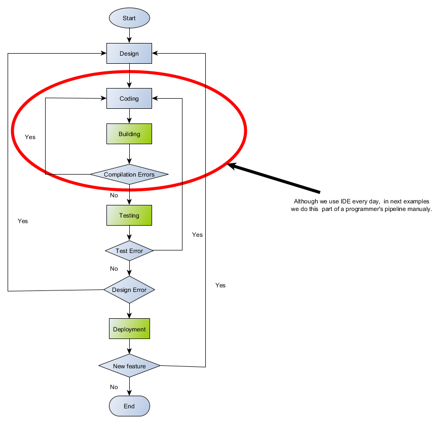  
Figure 1.1 A programmer flowchart  

[Design](https://en.wikipedia.org/wiki/Software_design) is the process we create a specification of a solution.  
[Coding](https://en.wikipedia.org/wiki/Computer_programming) is the realization of an application.  
[Building](https://en.wikipedia.org/wiki/Software_build) is the process of converting source code files into standalone software binaries.  
[Testing](https://en.wikipedia.org/wiki/Software_testing) is the process of checking quality and finding bugs.:bug::bug::bug:  
[Deployment](https://en.wikipedia.org/wiki/Software_deployment) is all of the activities that make a software system available for use.  

In this tutorial we'll use [CMake]({{site.baseurl}}/Docs/AdditionalReadingResources#cmake-id). It is a suite of tools which can help us to end up our project successfully. It is useful from building then testing right through to preparing packages ready for distribution.

### Compilation environment

To work properly a compiler needs a correct operating environment. The tools in the toolchain are command-line build tools, which need several environment variables to work properly. Variables are customized for your installation and build configuration. For instance Visual C++ command-line tools use the PATH, TMP, INCLUDE, LIB, and LIBPATH environment variables. (see detail [Set the Path and Environment Variables for Command-Line Builds]({{site.baseurl}}/Docs/AdditionalReadingResources#MSVC-id)). For GNU compilers see [Environment Variables Affecting GCC]({{site.baseurl}}/Docs/AdditionalReadingResources#GNU-id). As a cross-platform programmers we should think abstractively. Try to think of building process in general terms and treat your build tools as a implementation of a part of this abstraction. Just like [OOP](https://en.wikipedia.org/wiki/Object-oriented_programming). When I write a terminal or a console I mean any implementation of it, [macOS](https://en.wikipedia.org/wiki/Terminal_(macOS)), [Mintty]({{ site.baseurl}}/Docs/AdditionalReadingResources#MSYS2-id) for example. A shell, it can be [Bash]({{ site.baseurl}}/Docs/AdditionalReadingResources#GNU-id), [Cmd]({{ site.baseurl}}/Docs/AdditionalReadingResources#MSVC-id). To prepare a compilation environment Windows toolchains provide scripts (see details [piggybacking](#piggybackings) for [MSVC](#msvc)  and [MSYS2](#msys2)) that set a number of environment variables required for build tools. On Linux there is typically a dominant C++ compiler and the compiling environment is set out of box. A process of building binaries manually can be described as follow:

- open your terminal/console;  
- if it's applicable set any environment variables required by your toolset;  
- enter commands for a building (compile, archive, link)

For Windows users. Very often for Mingw64 compiler setting Path variable is enough. Although using shortcut [Mingw64-shell](#mingw64-shell) is **preferable**. To set variable write in command line:  
    **set PATH=\<directory where your Mingw64 compiler is>;%PATH%**;

### Source code

C++ supports separate compilation. We can split our program into several files, each of which can be compiled independently. In short .h files contains declaration, .cpp files hold definitions, implementation within themselves.

### Header file

To make a compiler happy all names in C++ must be declared before they can be used. Thus header files contains declarations of variables, functions and classes. They cannot contain definitions.
There is more. See [Declarations and Definitions]({{site.baseurl}}/Docs/AdditionalReadingResources#c).

## Building binaries

We need the three basic tools :hammer::hammer::hammer: to build C++ applications. These are the compiler:hammer:, the linker:hammer:, and
the librarian:hammer:. **Remember these are command line tools.** Again a [**toolchain**](https://en.wikipedia.org/wiki/Toolchain) is a set of these programs and additional tools. The compiler transforms C++ source code files and produces [object file](https://en.wikipedia.org/wiki/Object_file). The librarian create a static library from a set of object files. The linker takes object files and libraries and resolves their symbolic references to generate an executable (application) or a dynamic/shared library. The object files and static libraries are only needed during building an application. An executable may depend on dynamic/shared libraries thus they are essential during the execution of app and have to be accessible when the application is running. What is more one shared library may rely on other shared ones.  

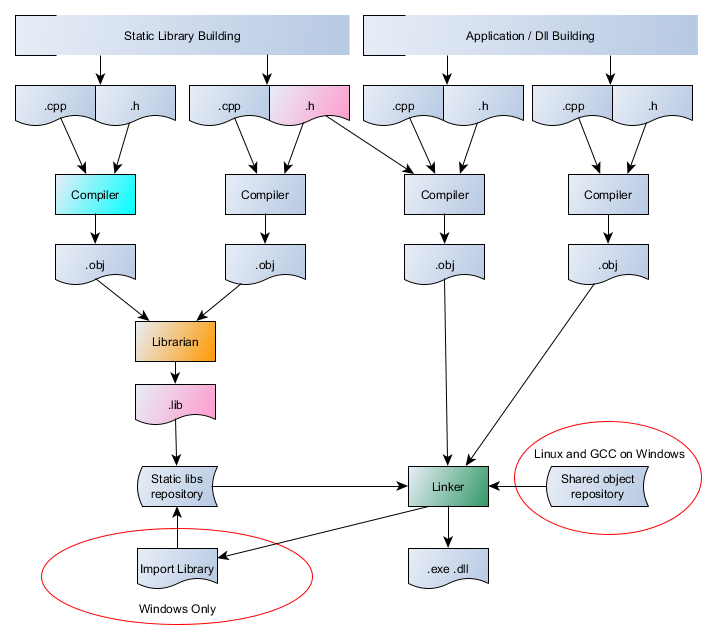  
Figure 1.2 The compile and link process.  

The figure above presents **The Three Musketeers** (a compiler, librarian and linker) in action. On the left you see a process of creation of a static library, which is later linked to an executable or dynamic link library by the linker. Every program that uses a library facility must include its associated header.
Therefore in the previous compilation stage of our application we had to include a library header. On Windows when a program contains exports additional [import library]({{site.baseurl}}/Docs/AdditionalReadingResources#MSVC-id) is created by the linker. An import library is a library that automates the process of loading and using a dynamic library. On Windows this is a small separated static library, the only exception is GCC which can links shared object (.so) directly. On linux a share object (.so) works as dynamic and import library and can be specified as input to the linker.

### Compilation process

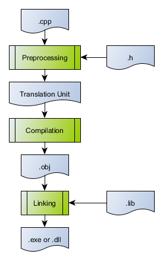  
Figure 1.3 The compilation process.

In the first preprocessor stage the contents of all header files (.h) are included into source file (.cpp). A [translation unit]({{site.baseurl}}/Docs/AdditionalReadingResources#compiler) is created. It means that all macros are expanded, #pragma information is added, each #ifdef/ifndef is validated. Sections of code is included or skipped respectably. The each translation unit is compiled and an object file is generated. The object file contains native machine code and information about external references. In the next stage the linker resolves external references, joins code from other object files or libraries. If the linker finds all externals the executable or dynamic dll is generated. Otherwise no binary is produces and error messages from the linker are sent to the console.

### Predefined Macros

Although we didn't supply their definitions we can use them as macros. These are [predefined macros]({{site.baseurl}}/Docs/AdditionalReadingResources#compilers). There are four classes of them: standard, common, system-specific and the named operators. The named operators cannot be undefine. Some predefined macros depend on compilers options. How can we check active predefined macros? For gnu compiler it's simple. Open gnu compiler environment and type: **gcc -E -xc++ -dM /dev/null** in your terminal. For MSVC open developer command prompt x86 then x64, compile checkpredefines.cpp from my Cmaketopia repository **cl /c /EHsc checkpredefines.cpp** . See some macros are platform specific. _Win64 macro for instance.  
To find out how it works see snippet below.

```c++
#define __STRINGVALUE__(x) #x
#define __VALUE__(x) __STRINGVALUE__(x)
#define __PPOUT__(x) "#define " #x " " __VALUE__(x)

#if defined(_ATL_VER)
    #pragma message(__PPOUT__(_ATL_VER))
#endif
```

### Building executable

It's time for our first **Hello**:hand: example. A source code for hello application is below.  

```c++
#include <iostream>  
int main()  
{  
 std::cout << "Hello, World!"  
 return 0;  
}
```  

Look at the [Figure 1.1](#a-typical-programmers-pipeline), we are just after the design step. We decided to use the standard cout function in our application that writes text to standard output stream which prints the "Hello, World!" string on   our monitor. No bad, very good design!  
**Go on and get your hands dirty !**

1. Coding:smile: :smile: :smile: - a preparation App Source Code:
    - to do this run a simple text editor for an example Notepad or Notepad++;
    - write a program and save a file to the disk to a location of your choice  
        (I use "**c:/TestCmaketopia**"). Name the file "**hello.cpp**".
2. Building - a creation of an executable to run on your platform  
    - open terminal;
    - set your compilation environment for your toolset;
    - enter a command in command line to compile and link your program  
        **One step building** - the compiler automatically invokes the linker after compiling

        | Compiler | Compiling+Linking |
        | ----------- | ----------- |
        | MSVC | cl /EHsc hello.cpp |
        | Mingw64 | g++ -o hello hello.cpp |

        **Two steps building** - we have to enter two commands, in first step object file is created, in second step linker creates executable

        | Compiler | Compiling | Linking |
        | ----------- | ----------- |
        | MSVC | cl /c /EHsc hello.cpp | link -out:hello.exe hello.obj
        | Mingw64 | g++ -c -o hello.o hello.cpp| g++ -o hello hello.o

D'oh!:angry: We've got a bug,:bug:.Back to square one (Coding:smile: :smile: :smile:)!!!  
Run your editor open hello.cpp file add **;** after "Hello, World!" save your file.  
Here is a correct version of code.

```c++
#include <iostream>  
int main()  
{  
 std::cout << "Hello, World!";  
 return 0;  
}
```  

Compile your source code again. Now, after we do that and assuming that we didn't make any typos and the code compiles fine, we have a file called hello in the source code directory, and now we can finally run our hello app.  
**Type ./hello in command line and press \<Enter>.** and no surprise it will print Hello, world! to the terminal.  

Our next task is a creation of a math module in two forms - a static or dynamic library. A few words about our Sum project. Sum project are split across multiple source files. This splitting simplifies a development and speeds up compilation. The project includes Sum.cpp - main program. Calculator.cpp - our math module. Calculator.h contains declarations of Calculator class. We want to group math operations into a library. To build Sum project we have to use a compiler to compile the source files into object files. Next steps depends on what kind of a library we want to create. The last step is always the same, we use linker to resolve externals.

### Build a static library

Static libraries is a set of object files (with typical extension *.obj or *.o), composed into a single file (.lib). It should not contain any specifying storage-class information (__declspec or __attribute((dll...))). We need create a static library using a librarian. Next we link main Sum object with a library to create executable.

#### Mingw-w64 toolchain

| Step | Command |
| ----------- | ----------- |
| compile **Sum.cpp** into object file | g++ -c -o Sum.o Sum.cpp |
| compile **Calculator.cpp** into object file | g++ -c -o Calculator.o Calculator.cpp |
| create static library **libCalculator.a** | ar ru libCalculator.a Calculator.o |
| create executable **SumGCC** | g++ -o SumGCC Sum.o libCalculator.a |

#### MSVC toolchain

| Step | Command |
| ----------- | ----------- |
| compile **Sum.cpp** into object file | cl -c -EHsc -FoSum Sum.cpp |
| compile **Calculator.cpp** into object file | cl -c -EHsc Calculator.cpp |
| create static library **Calculator.lib** | lib -out:Calculator.lib Calculator.obj |
| create executable **SumMSVC** | link -out:SumMSVC.exe Sum.obj Calculator.lib |

### Build a dynamic library

A dynamic library consists of code and data that are loaded into your application at run time. The structure of dynamic library and the executable is identical, the only difference being that dynamic library lacks the startup routines (main entry point). The dynamic library can't be started as independent
program by platform alone. Another important issue concerning a dynamic library is **symbol visibility**.
On Windows most toolsets don't export symbols by default. In particular, the Microsoft Visual Studio Compiler doesn't export any symbols. Each symbol must be explicitly exported when the dynamic library is built. It's imported during building an executable or dynamic library that want to refer to it. To export symbols we use the __declspec(dllexport) attribute, again the attribute __declspec(dllimport) to import. Quite the contrary  MinGW exports ALL symbols of a DLL by default. The same on Linux. In this example I show how linking the DLL directly using MinGW compiler.  

| Step | Command |
| ----------- | ----------- |
| create dynamic library **DirectLinkingCalculator** | g++ -fPIC --shared -o DirectLinkingCalculator.dll Calculator.cpp |
| create executable **DirectLinkingSum** | g++ -L. -lDirectLinkingCalculator -o DirectLinkingSum Sum.cpp |

If you want to see __declspec(dllexport/dllimport) example finish reading and jump to [Project Organization]({{site.baseurl}}/Docs/ProjectOrganization).

### Piggybackings

Additionally we have available piggybackings, the facilities for programmers who like building executables from command line. See below how to use shortcuts to set environment variables begladding your compiler on Windows 10 platform:

#### MSVC

For detail see [Build C/C++ code on the command line]({{site.baseurl}}/Docs/AdditionalReadingResources#MSVC-id) and [C/C++ Build Tools]({{site.baseurl}}/Docs/AdditionalReadingResources#MSVC-id).  
These shortcuts below open Command Prompt and set a compiler environment; just use one of them  
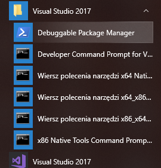  
Hey a tough guy wanna more?  
If you have not standard installation of Visual Studio or you are curious, do you want to know where a workhorse is?  
Right click **x86 Native Command Prompt** select **More** select **Open file location**  
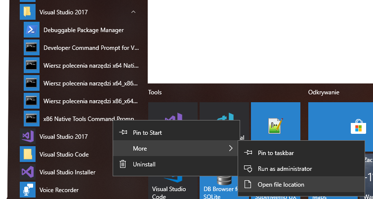  
now right click on **x86 Native Tools Command Prompt** select **Properties** click inside Target field select all (cntr-A) copy (cntr-c) open your text editor paste string (cntr-v) save file. **Important!!!**  
Don't worry we are on home straight now!  
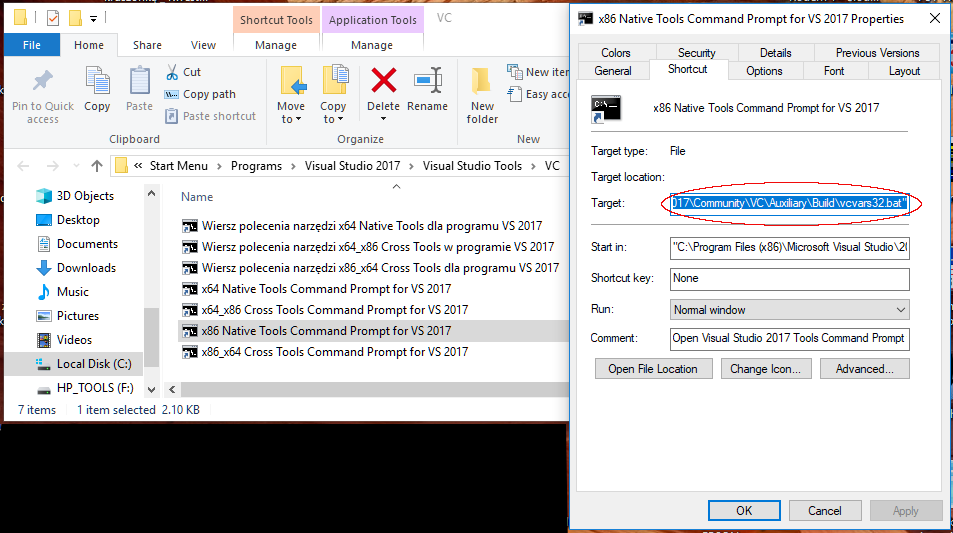  

You should have something like that in your file  
**%comspec% /k "C:\Program Files (x86)\Microsoft Visual Studio\2017\Community\VC\Auxiliary\Build\vcvars32.bat"**  extract path  
**C:\Program Files (x86)\Microsoft Visual Studio\2017\Community\VC\Auxiliary\Build**  
Now it's time for a party! Open file explorer put your path in it, look there is **vcvarsall.bat** .  
**IT'S OUR WORKHORSE:horse:!!!**  
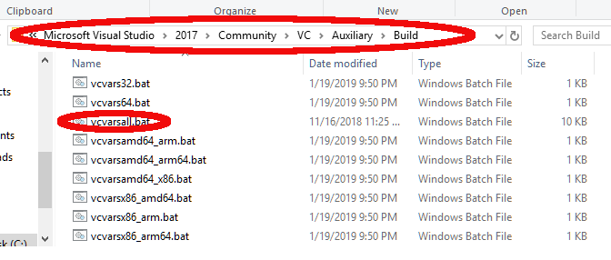  
A procedure for CMaketopians how set up MSVC compiler environment:

- open command line  
- set PATH=C:\Program Files (x86)\Microsoft Visual Studio\2017\Community\VC\Auxiliary\Build;%PATH%  
- **cmd /k "vcvarsall.bat x86"**    or  
- cmd /k "vcvarsall.bat x64"

[see vcvarsall.bat documentation]({{site.baseurl}}/Docs/AdditionalReadingResources#MSVC-id)  
More?  
Change cmd /k "vcvarsall.bat x64 to **cmd /k "vcvarsall.bat x64 & PowerShell"** and have fun.  
From then on you can use **PowerShell** as your terminal.

#### MSYS2

[MSYS2]({{site.baseurl}}/Docs/AdditionalReadingResources#MSYS2-id) is software distribution and a building platform for Windows. It provides a Unix-like environment, a command-line interface and a software repository. MSYS2 MSYS shortcut opens POSIX-compliant environment. Use it for package management, shell scripting and building POSIX projects. When you click MING-w64 shortcuts they create windows GNU compiler environment x86 or x64 respectively.  
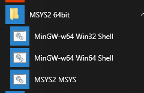  
By default, MSYS2 automatically dumb your PATH environment variable down. To display your MSYS2 path setting run MSY2 terminal, type **export -p | grep PATH**. You can change this behavior by setting an Windows system environment variable **MSYS2_PATH_TYPE=inherit** . When you set it, MSYS2 inherits PATH variable from Windows. Fortunately, MSYS2 allows a user to do some a fine-grain customization also. To do that you need to know where your home directory is. Type **export -p | grep HOME**. The default $HOME directory is C:/msys64/home/\<username>. Launch Notepad and edit **bash_profile** file from your home directory. To let Cmake windows installation run into MSYS2 environment I added path referred to Cmake.exe. If you want to use other apps modify PATH settings respectably.  
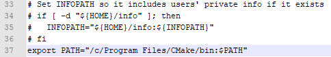  
For more details see [Bash]({{ site.baseurl}}/Docs/AdditionalReadingResources#GNU-id) or [Environment Variables Affecting GCC]({{ site.baseurl}}/Docs/AdditionalReadingResources#GNU-id)  

If you created Sum project together with me, you should have a directory named Sum with many files.

```txt

\---Sum
        Calculator.cpp
        Calculator.h
        Calculator.lib
        Calculator.o
        DirectLinkingCalculator.dll
        DirectLinkingSum.exe
        libCalculator.a
        Sum.cpp
        Sum.o
        Sum.obj
        SumGCC.exe
        SumMSVC.exe
```

What a big mess you must admit. Binaries mixed with headers and source files. Now imagine your project has a hundred source files... Well, we'll deal with the problem soon.

#### Building SQLITE binaries from source code

After wasting your time on reading about all this stuff you may ask "What the heck is going on?". Is it really important to know building toolsets? Let me answer a few of your questions now. There are many fantastic open source projects but I want to show you something special and very popular. This project is in the public domain, it means that you're free to use it for any purpose, commercial or private, and there are no legal restrictions and no copyright notices that you need to distribute. I want you to get to know of SQLite. This is an incredible little database engine, very fast and lightweight. SQLite is a database engine implemented entirely in the C programming language with source code freely available. Suppose that a new version of SQLite is available with new features, we need in our super project now. You checked NuGet, GitHub but nobody prepared a new release, or you need extra optimized SQLite library  with extra compiler's switches. So we must do it ourselves. Instead of losing time on creating a huge project, we will do it very simple. You, PowerShell and MSVC compiler will be enough.  
First we'll create the **SQLite shell program** to play with a new toy. Please, follow these simple steps:

1. cd c:\
2. mkdir SQLite
3. launch your browser
4. go to SQLite.org
5. download the SQLite Amalgamation to c:\SQLite
6. run  x64 Native Tools Command Prompt
7. type powershell in command prompt and press enter
8. cd c:\SQLite (see a picture below to see a compilation session)
9. check PowerShell version $PSVersionTable.PSVersion if > 5 you can unzip a file using a command line
10. [Expand-Archive]({{site.baseurl}}/Docs/AdditionalReadingResources#powershell) -Path sqlite-amalgamation-\<yourversion>.zip -DestinationPath .
11. cd SQLite-Amalgamation-\<yourversion>
12. run cl shell.c sqlite3.c '-Fesqlite3.exe'

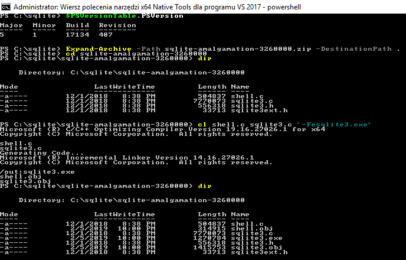  
Now run a new toy. Type **./sqlite3** \<Enter>  
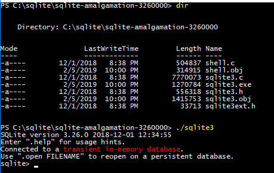

#### Wrap-up

Go ahead! From then on, you have knowledge what to do and where are the knobs. Although in our daily work we use IDE now you know what is going on under the hood.  
Because we need to keep projects clean and tidy. It's high time to put all items in apple-pie order.  
Next topic Project Organization (try Next navigation at the bottom).  

It's curtains now, chill out:metal: and press the button below if you want.  

<!-- blank line -->
<figure class="video_container">
  <iframe src="https://www.youtube.com/embed/l482T0yNkeo" frameborder="0" allowfullscreen="true"> </iframe>
</figure>
<!-- blank line -->
