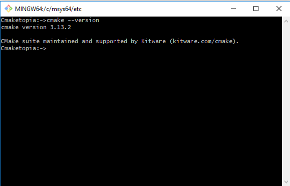
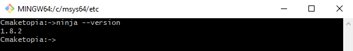

# Command Line

## Highway to Hell for a tough cookie

Our previous levels were a breeze, but from then on the story shifts gears. Get up on your feet we start grappling with basis of a command line. A wise deviser:construction_worker: have to understand the relation between components to solve problems of their domain and how the compilation pipeline looks like. The grasp of this concept is crucial. We must be deft like a swan, which glides:airplane: across the surface of the lake. Stop being like a rabbit:rabbit: caught in the headlights controlled by your favoured [IDE](https://en.wikipedia.org/wiki/Integrated_development_environment).  

**Rule No. One - You're a boss and you know the ropes.**  
**Rule No. Two - The command line is your friend.**  
**Rule No. Three - The compiler is your friend.**  

## A typical programmer's pipeline

  
We need the three basic tools :hammer::hammer::hammer: to build C++ applications. These are the compiler:hammer:, the linker:hammer:, and
the librarian:hammer:. **Remember these are command line tools.** Again a [**toolchain**](https://en.wikipedia.org/wiki/Toolchain) is a set of these programs and additional tools. The compiler transforms C++ source code files and produces [object file](https://en.wikipedia.org/wiki/Object_file). The librarian create a static library from a set of object files. The linker takes object files and libraries and resolves their symbolic references to generate an executable (application) or a dynamic/shared library. The object files and static libraries are only needed during building an application. An executable may depend on dynamic/shared libraries thus they are essential during the execution of app.  
It's time for our first **Hello**:hand: example. A source code for hello application is below  

```c++
#include <iostream>  
int main()  
{  
 std::cout << "Hello, World!"  
 return 0;  
}
```  

Look at the diagram, we are just after the design step. We decided to use the standard cout function in our application that writes text to standard output stream which prints the "Hello, World!" string on   our monitor. No bad, very good design!  
**Go on and get your hands dirty !**

1. Coding:smile: :smile: :smile: - preparation App Source Code:
    - to do this run a simple text editor for an example Notepad or Notepad++;
    - write a program and save a file to the disk to a location of your choice (I use "**c:/TestCmaketopia**"). Name the file "**hello.cpp**".
2. Build binaries - creation of an executable to run on your platform
    - set any environment variables required by your toolset.  
    See [Microsoft Compiler](https://docs.microsoft.com/en-us/cpp/build/setting-the-path-and-environment-variables-for-command-line-builds?view=vs-2017)
    and [here](https://blogs.msdn.microsoft.com/vcblog/2017/11/02/visual-studio-build-tools-now-include-the-vs2017-and-vs2015-msvc-toolsets/);  
    Mingw64 set Path: set PATH=\<directory where your compiler is>;%PATH%
    - enter a command in command line telling your compiler to compile and link your program.  
        Microsoft compiler [cl /EHsc hello.cpp](https://docs.microsoft.com/en-us/cpp/build/walkthrough-compiling-a-native-cpp-program-on-the-command-line?view=vs-2017)  
        Mingw64: invoke the compiler passing in the name of our file, in this case hello.cpp  
        **g++ -o hello hello.cpp**

D'oh!:angry: We've got a bug,:bug:.Back to square one (Coding:smile: :smile: :smile:)!!! Run your editor open hello.cpp file add **;** after "Hello, World!" save your file. Compile your source code again. Now, after we do that and assuming that we didn't make any typos and the code compiles fine, we have a file called hello in the source code directory, and now we can finally run our hello app.  
**Type ./hello in command line and press \<Enter>.** and no surprise it will print Hello, world! to the terminal. When the [build systems](https://en.wikipedia.org/wiki/List_of_build_automation_software) come into play we should be familiar with a notion of [target](https://cmake.org/cmake/help/v3.13/manual/cmake-buildsystem.7.html). The build systems:construction_worker::construction_worker: organize files into targets. Each target corresponds to an executable or library, or is a custom target containing custom commands or actions the build tool must perform, such as installing an application. It's about time we need to get familiar with the main actors of our story. Ladies and gentlemen let me introduce a fantastic couple:couple: [Cmake](https://cmake.org/) and [Ninja](https://ninja-build.org/). As we may expect these are command line tools too. It means we need run they from a shell. [Run your shell](https://en.wikipedia.org/wiki/Shell_\(computing\)) such a bash on Unix , cmd.exe or Mingw64-w64 shell on Microsoft. Now an operating system is at our command.  
Type **cmake \-\-version** and press Enter.
  
Type **cmake \-\-help** don't forget about **enter**, now  **cmake \-\-help-command-list** and **cmake \-\-help-manual-list**. I feel we got the hang of the first tool.  
Now Ninja. Type **ninja \-\-version** and press Enter. Look at Ninja documentation, try another command. All is under our control. We are not rabbits :rabbit::rabbit2: now.  


Although in our daily work we use IDE now you know what is going on under the hood.  
Additionaly we have available piggybackings (the facilities for programmers) who like building executables from command line. See below how to use shortcuts to set environment variables beglading your compiler on Windows 10 platform:

You could [Open a developer command prompt](https://docs.microsoft.com/en-us/cpp/build/walkthrough-compiling-a-native-cpp-program-on-the-command-line?view=vs-2017) if you are Visual Studio user;   

or  

you can [Set G++ compiler's environment variables](https://gcc.gnu.org/onlinedocs/gcc/Environment-Variables.html) if you are Mingw64 user. 

It's curtains now, chill out:metal: and press the button below if you want.

<!-- blank line -->
<figure class="video_container">
  <iframe src="https://www.youtube.com/embed/l482T0yNkeo" frameborder="0" allowfullscreen="true"> </iframe>
</figure>
<!-- blank line -->
