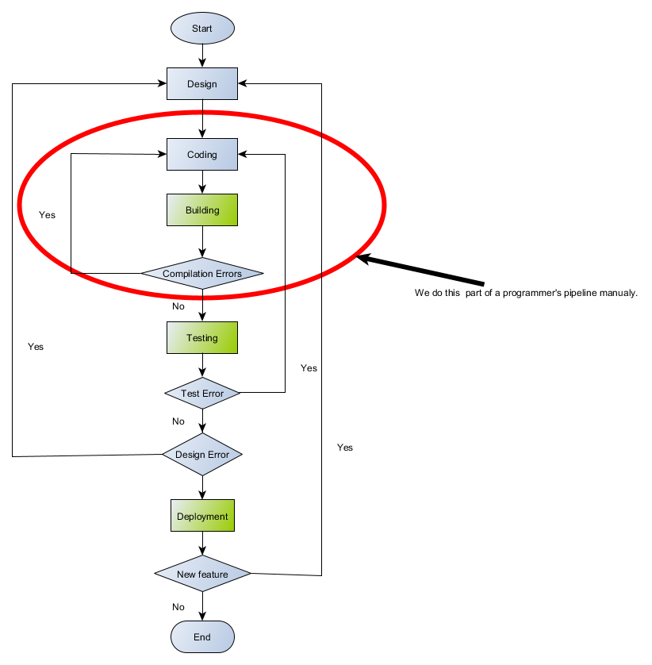

# Command Line

## Highway to Hell for a tough cookie

Our previous levels were a breeze, but from then on the story shifts gears. Get up on your feet we start grappling with basis of a command line. A wise deviser have to understand the relation between components to solve problems of their domain and how the compilation pipeline looks like. The grasp of this concept is crucial. We must be deft like a swan, which glides across the surface of the lake. Stop being like a rabbit caught in the headlights controlled by your favoured [IDE](https://en.wikipedia.org/wiki/Integrated_development_environment).  

**Rule No. One - You're a boss and you know the ropes.**  
**Rule No. Two - The command line is your friend.**  
**Rule No. Three - The compiler is your friend.**  

## A typical programmer's pipeline

  
It's time for our first Hello example. A source code for hello application is below  

**\#include \<iostream>  
int main()  
{  
 &nbsp;&nbsp;&nbsp;&nbsp;std::cout << "Hello, World!"  
 &nbsp;&nbsp;&nbsp;&nbsp;return 0;  
}**  

Look at the diagram,we are just after the design step. We decided to use the standard cout function in our application that writes text to standard output stream which prints the "Hello, World!" string on the  our monitor. No bad, very good design!  
**Go on and get your hands dirty !**

1. Coding:smile: :smile: :smile: - Prepare a source code:
    - to do this run a simple text editor for an example Notepad or Notepad++;
    - write a program and save a file to the disk to a location of your choice (I use "**c:/TestCmaketopia**"). Name the file "**hello.cpp**".
2. Build binaries - invoke the compiler passing in the name of our file, in this case hello.cpp
    - set any environment variables required by your toolset.  
    See [Microsoft Compiler](https://docs.microsoft.com/en-us/cpp/build/setting-the-path-and-environment-variables-for-command-line-builds?view=vs-2017)
    and [here](https://blogs.msdn.microsoft.com/vcblog/2017/11/02/visual-studio-build-tools-now-include-the-vs2017-and-vs2015-msvc-toolsets/);  
    Mingw64 set Path: set PATH=\<directory where your compiler is>;%PATH%
    - enter a command in command line telling your compiler to compile and link your program.  
        Microsoft compiler [cl /EHsc hello.cpp](https://docs.microsoft.com/en-us/cpp/build/walkthrough-compiling-a-native-cpp-program-on-the-command-line?view=vs-2017)  
        Mingw64: g++ -o hello hello.cpp
       D'oh!:angry: We've got an error,  
       \- back to square one (Coding:smile: :smile: :smile:) -  
       run your editor open hello.cpp file add **;** after "Hello, World!" save your file;  
3. Type ./hello in command line and press \<Enter>.

Piggybackings:

1. [Open a developer command prompt](https://docs.microsoft.com/en-us/cpp/build/walkthrough-compiling-a-native-cpp-program-on-the-command-line?view=vs-2017)
2. Mingw64 compiler use this one 

It's curtains now, chill out and press the button below.

<!-- blank line -->
<figure class="video_container">
  <iframe src="https://www.youtube.com/embed/l482T0yNkeo" frameborder="0" allowfullscreen="true"> </iframe>
</figure>
<!-- blank line -->
