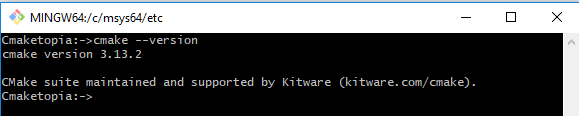

# Command Line

## Highway to Hell for a tough cookie

Our previous levels were a breeze, but from then on the story shifts gears. Get up on your feet we start grappling with basis of a command line. A wise deviser:construction_worker: have to understand the relation between components to solve problems of their domain and how the compilation pipeline looks like. The grasp of this concept is crucial. We must be deft like a swan, which glides:airplane: across the surface of the lake. Stop being like a rabbit:rabbit: caught in the headlights controlled by your favored [IDE](https://en.wikipedia.org/wiki/Integrated_development_environment).  

**Rule No. One - You're a boss and you know the ropes.**  
**Rule No. Two - The command line is your friend.**  
**Rule No. Three - The compiler is your friend.**  

## A typical programmer's pipeline

  

## Building binaries

We need the three basic tools :hammer::hammer::hammer: to build C++ applications. These are the compiler:hammer:, the linker:hammer:, and
the librarian:hammer:. **Remember these are command line tools.** Again a [**toolchain**](https://en.wikipedia.org/wiki/Toolchain) is a set of these programs and additional tools. The compiler transforms C++ source code files and produces [object file](https://en.wikipedia.org/wiki/Object_file). The librarian create a static library from a set of object files. The linker takes object files and libraries and resolves their symbolic references to generate an executable (application) or a dynamic/shared library. The object files and static libraries are only needed during building an application. An executable may depend on dynamic/shared libraries thus they are essential during the execution of app and have to be accessible when the application is running. What is more one shared library may rely on other shared ones.  

### Compilation environment

The tools in the toolchain are command-line build tools, which need several environment variables to work properly. Variables are customized for your installation and build configuration. For instance Visual C++ command-line tools use the PATH, TMP, INCLUDE, LIB, and LIBPATH environment variables. (see detail [Set the Path and Environment Variables for Command-Line Builds]({{site.baseurl}}/Docs/AdditionalReadingResources#MSVC-id)). For GNU compilers see [Environment Variables Affecting GCC]({{site.baseurl}}/Docs/AdditionalReadingResources#GNU-id). As a cross-platform programmers we should think abstractively. Try to think of building process in general terms and treat your build tools as a implementation of a part of this abstraction. Just [OOP](https://en.wikipedia.org/wiki/Object-oriented_programming). When I write a terminal or console I mean any implementation of it. It can be [Bash]({{ site.baseurl}}/Docs/AdditionalReadingResources#GNU-id), [Cmd]({{ site.baseurl}}/Docs/AdditionalReadingResources#MSVC-id) or [Mintty]({{ site.baseurl}}/Docs/AdditionalReadingResources#MSYS2-id). To prepare a compilation environment Windows toolchains provide scripts (see details [piggybacking](#piggybackings) for [MSVC](#msvc)  and [Mingw64-shell](#mingw64-shell)) that set a number of environment variables required for build tools. On Linux there is typically a dominant C++ compiler and the compiling environment is set out of box. A process of building binaries can be described as follow:

- open your terminal;  
- if it's applicable set any environment variables required by your toolset;  
- enter commands for a building (compile, archive, link)

For Windows users. Very often for Mingw64 compiler setting Path variable is enough. Although using shortcut [Mingw64-shell](#mingw64-shell) is **preferable**. To set variable write in command line:  
    **set PATH=\<directory where your Mingw64 compiler is>;%PATH%**;

### Building executable

It's time for our first **Hello**:hand: example. A source code for hello application is below.  

```c++
#include <iostream>  
int main()  
{  
 std::cout << "Hello, World!"  
 return 0;  
}
```  

Look at the diagram, we are just after the design step. We decided to use the standard cout function in our application that writes text to standard output stream which prints the "Hello, World!" string on   our monitor. No bad, very good design!  
**Go on and get your hands dirty !**

1. Coding:smile: :smile: :smile: - a preparation App Source Code:
    - to do this run a simple text editor for an example Notepad or Notepad++;
    - write a program and save a file to the disk to a location of your choice  
        (I use "**c:/TestCmaketopia**"). Name the file "**hello.cpp**".
2. Building - a creation of an executable to run on your platform  
    - open terminal;
    - set your compilation environment for your toolset;
    - enter a command in command line to compile and link your program  
        **One step building** - the compiler automatically invokes the linker after compiling

        | Compiler | Compiling+Linking |
        | ----------- | ----------- |
        | MSVC | cl /EHsc hello.cpp |
        | Mingw64 | g++ -o hello hello.cpp |

        **Two steps building** - we have to enter two commands, in first step object file is created, in second step linker creates executable

        | Compiler | Compiling | Linking |
        | ----------- | ----------- |
        | MSVC | cl /c /EHsc hello.cpp | link -out:hello.exe hello.obj
        | Mingw64 | g++ -c -o hello.o hello.cpp| g++ -o hello hello.o

D'oh!:angry: We've got a bug,:bug:.Back to square one (Coding:smile: :smile: :smile:)!!!  
Run your editor open hello.cpp file add **;** after "Hello, World!" save your file.  
Here is a correct version of code.

```c++
#include <iostream>  
int main()  
{  
 std::cout << "Hello, World!";  
 return 0;  
}
```  

Compile your source code again. Now, after we do that and assuming that we didn't make any typos and the code compiles fine, we have a file called hello in the source code directory, and now we can finally run our hello app.  
**Type ./hello in command line and press \<Enter>.** and no surprise it will print Hello, world! to the terminal.

### Build static library

Under construction

### Build dynamic library

Under construction

## Build system

Software projects always need build system to configure the build options and create the final applications or libraries from sources. That tasks developers have to repeat several times every
day, so it is extremely important to ensure that the process is under control and reproducible. When the [build systems](https://en.wikipedia.org/wiki/List_of_build_automation_software) come into play we should be familiar with a notion of a [target](https://cmake.org/cmake/help/v3.13/manual/cmake-buildsystem.7.html). The build systems:construction_worker::construction_worker: organize files into targets. Each target corresponds to an executable or library, or is a custom target containing custom commands or actions the build tool must perform, such as installing an application. It's about time we need to get familiar with the main actors of our story. Ladies and gentlemen let me introduce a fantastic couple:couple: [Cmake](https://cmake.org/) and [Ninja](https://ninja-build.org/). As we may expect these are command line tools too. It means we need run they from a shell. [Run your shell](https://en.wikipedia.org/wiki/Shell_\(computing\)) such a bash on Unix , cmd.exe or Mingw64-w64 shell on Windows. Now an operating system is at our command.  
Type **cmake \-\-version** and press Enter.
  
Type **cmake \-\-help** don't forget about **enter**, now  **cmake \-\-help-command-list** and **cmake \-\-help-manual-list**. I feel we got the hang of the first tool.  
Now Ninja. Type **ninja \-\-version** and press Enter. Look at Ninja documentation, try another command. All is under our control. We are not rabbits :rabbit::rabbit2: now.  
  
Although in our daily work we use IDE now you know what is going on under the hood.  

### Piggybackings

Additionally we have available piggybackings, the facilities for programmers who like building executables from command line. See below how to use shortcuts to set environment variables begladding your compiler on Windows 10 platform:

#### MSVC

For detail see [Build C/C++ code on the command line]({{site.baseurl}}/Docs/AdditionalReadingResources#MSVC-id). These shortcuts open terminal and set a compiler environment; just use one of them  
  
Hey a tough guy wanna more?  
If you have not standard installation of Visual Studio, do you want to know where a workhorse is?  
Right click **x86 Native Command Prompt** select **More** select **Open file location**  
  
now right click on **x86 Native Tools Command Prompt** select **Properties** click inside Target field select all (cntr-A) copy (cntr-c) open your text editor paste string (cntr-v) save file. **Important!!!**  
Don't worry we are on home straight now!  
  

You should have something like that in your file  
**%comspec% /k "C:\Program Files (x86)\Microsoft Visual Studio\2017\Community\VC\Auxiliary\Build\vcvars32.bat"**  extract path  
**C:\Program Files (x86)\Microsoft Visual Studio\2017\Community\VC\Auxiliary\Build**  
Now it's time for a party! Open file explorer put your path in it, look there is **vcvarsall.bat** .  
**IT'S OUR WORKHORSE:horse:!!!**  
  
A procedure for CMaketopians how set up MSVC compiler environment:

- open command line  
- set PATH=C:\Program Files (x86)\Microsoft Visual Studio\2017\Community\VC\Auxiliary\Build;%PATH%  
- **cmd /k "vcvarsall.bat x86"**    or  
- cmd /k "vcvarsall.bat x64"

[see vcvarsall.bat documentation]({{site.baseurl}}/Docs/AdditionalReadingResources#MSVC-id)  
More?  
Change cmd /k "vcvarsall.bat x64 to **cmd /k "vcvarsall.bat x64 & PowerShell"** and have fun.  
From then on you can use **PowerShell** as your terminal.

#### Mingw64 shell

For details see [Environment Variables Affecting GCC]({{ site.baseurl}}/Docs/AdditionalReadingResources#GNU-id)  

  
Go ahead! You know what to do.  

It's curtains now, chill out:metal: and press the button below if you want.

<!-- blank line -->
<figure class="video_container">
  <iframe src="https://www.youtube.com/embed/l482T0yNkeo" frameborder="0" allowfullscreen="true"> </iframe>
</figure>
<!-- blank line -->
