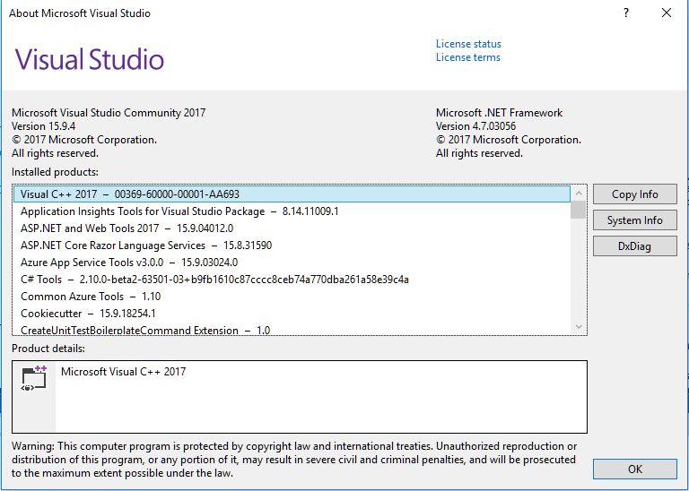
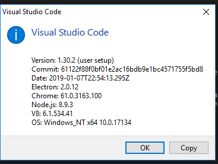
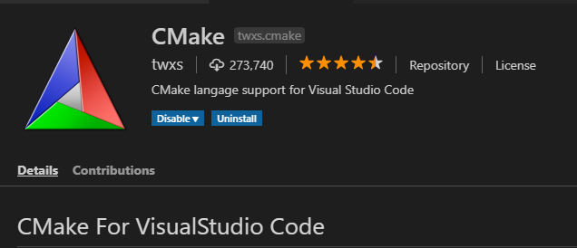
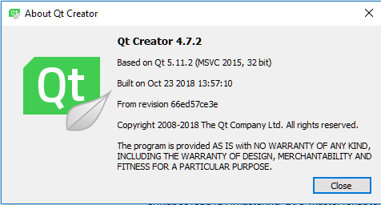
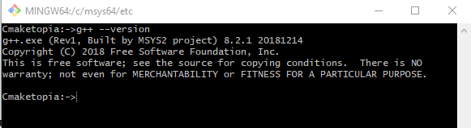

# Prepare Your Development Environment

To get started C++ programming you should know something about C++ language and building tools. Please head on over to [IsoCpp]({{site.baseurl}}/Docs/AdditionalReadingResources#iso-cpp) to get a hang of some ideas and piece of information on C++ infrastructure, recommended books, useful links, draft documents.

## On the bumpy road to Cmakeland

To start coding together with me you need:

1. Cmake
2. One C++ compiler or more:smile:
3. Ninja build tool
4. Your favourite IDE with CMAKE support or the preferable text editor

The minimum CMake version 3.8 is required for this tutorial. Run quickly:runner: to your computer grab [Cmake for your platform](https://cmake.org/download/) and install it. Download [Ninja](https://ninja-build.org/) and plant it in your platform.  

There are many good free C++ compilers you can use:

- [Gnu Compiler Collection](http://gcc.gnu.org/)
- [Clang](http://clang.llvm.org/get_started.html)
- [Visual C++ 2017 Community](https://visualstudio.microsoft.com/vs/features/cplusplus/) [^1]
- [Embarcadero](https://www.embarcadero.com/free-tools/ccompiler)
- [Oracle Solaris Studio C++ Compiler](https://www.oracle.com/technetwork/server-storage/developerstudio/overview/index.html)
- [IBM XL C/C++ Compiler](https://www.ibm.com/us-en/marketplace/xl-cpp-linux-compiler-power).

[^1]: You needn't to install Visual Studio to use MSVC, you only have to install [Microsoft build tools](https://www.visualstudio.com/downloads/#build-tools-for-visual-studio-2017) package (Microsoft C++ compiler + tools)

Install a compiler toolchain you prefer.
Also there are many IDEs supporting a cmake project development. On:

- Linux, Android, IOS (a place for your documentation)
- Windows, as your integrated development environment [IDE](https://en.wikipedia.org/wiki/Integrated_development_environment) you can use [Visual Studio 2017](https://docs.microsoft.com/en-us/visualstudio/install/install-visual-studio?view=vs-2017), [VS Code](https://code.visualstudio.com/), [Clion](https://www.jetbrains.com/clion/), [Code::Block](http://www.codeblocks.org/) or [QT Creator](https://www.qt.io/qt-features-libraries-apis-tools-and-ide/) which provide CMake support.  

## My development environment

OS - Windows 10 1809  

**CMake + Ninja**  
During a cmake installation remember to tick any "add to path" option. Be quick on the draw:zap:, just copy ninja.exe to Cmake/bin installation folder.  

I decided to install Mingw-w64 toolchains as c++ tools. If you want to use them either follow simple steps.  
**To setup the Mingw-w64[^2] environment, you need to:**

1. install [MSYS2](http://www.msys2.org/) and follow a instruction
2. open MSYS2 MSYS terminal
3. use pacman to install packages needed for c++ development

[^2]:another way to install MSYS2 and Mingw-w64 tools is using the package manager for Windows [Chocolatey](https://chocolatey.org/search?q=mingw-w64).

GNU make  
gettext a localization package  
base-devel developer's tools  
mingw-w64-x86_64-gcc c++ 64-bit compiler toolchain  
mingw-w64-i686-gcc   c++ 32-bit compiler toolchain  
mingw-w64-x86_64-gdb mingw-w64-i686-gdb  64-bit and 32-bit debuggers  

```txt
pacman -S make gettext base-devel
pacman -S mingw-w64-x86_64-gcc
pacman -S mingw-w64-i686-gcc
pacman -S mingw-w64-x86_64-gdb mingw-w64-i686-gdb
```

Additionally I installed:


  
For VsCode users:
To make your IDE fully fledged C++ environment for cmake projects you need to install 2 additional extensions.  
  
  
  

To check your environment run MSYS2 terminal and run g++, cmake and ninja  


  

Phew we are done. :+1:  
