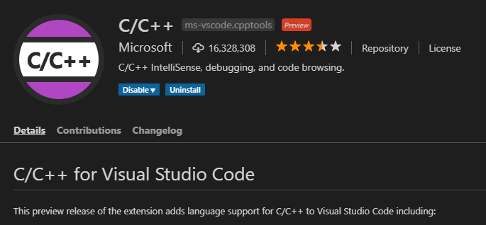

# Prepare Your Development Environment

To get started C++ programming you should know something about C++ language and building tools. Please head on over to [IsoCpp]({{site.baseurl}}/Docs/AdditionalReadingResources#iso-cpp) to get a hang of some ideas and piece of information on C++ infrastructure, recommended books, useful links, draft documents.

## On the bumpy road to Cmakeland

To start coding together with me you need:

1. Cmake
2. One C++ compiler or more:smile:
3. Ninja build tool
4. Your favourite IDE with CMAKE support or the preferable text editor

The minimum CMake version 3.8 is required for this tutorial. Run quickly:runner: to your computer grab [Cmake for your platform](https://cmake.org/download/) and install it, remember to tick any add to path option. Download [Ninja](https://ninja-build.org/) and plant it in your platform. Be quick on the draw:zap:, just copy ninja.exe to Cmake/bin installation folder.  
There are many good free C++ compilers you can use:

- [Gnu Compiler Collection](http://gcc.gnu.org/);
- [Clang](http://clang.llvm.org/get_started.html);
- [Visual C++ 2017 Community](https://visualstudio.microsoft.com/vs/features/cplusplus/);
- [Embarcadero:](https://www.embarcadero.com/free-tools/ccompiler)
- [Oracle Solaris Studio C++ Compiler](https://www.oracle.com/technetwork/server-storage/developerstudio/overview/index.html)
- [IBM XL C/C++ Compiler](https://www.ibm.com/us-en/marketplace/xl-cpp-linux-compiler-power)

Install a compiler toolchain you prefer and IDE that suit you:

- Linux, Android, IOS (a place for your documentation)
- Windows, as your integrated development environment [IDE](https://en.wikipedia.org/wiki/Integrated_development_environment) you can use [Visual Studio 2017](https://docs.microsoft.com/en-us/visualstudio/install/install-visual-studio?view=vs-2017), [VS Code](https://code.visualstudio.com/), [Clion](https://www.jetbrains.com/clion/), [Code::Block](http://www.codeblocks.org/) or [QT Creator](https://www.qt.io/qt-features-libraries-apis-tools-and-ide/) which provide CMake support. If you don't want to install Visual Studio, just need to install [Microsoft build tools](https://www.visualstudio.com/downloads/#build-tools-for-visual-studio-2017) package (Microsoft C++ compiler + tools) or use [the MSYS2  software distro](https://www.msys2.org) (remember to install [mingw-w64 C/C++ compiler's toolchain](https://github.com/Alexpux/MINGW-packages) pacman -S mingw64/mingw-w64-x86_64-cmake or pacman -S mingw64/mingw-w64-i686-cmake) or/and you can try [Chocolatey](https://chocolatey.org/packages/mingw) to install a [mingw-w64](https://mingw-w64.org/doku.php) compiler.

My development environment  

  
For VsCode users:
To make your IDE fully fledged C++ environment for cmake projects you need to install 2 additional extensions.  
  
  

  

Phew we are done. :+1:  
