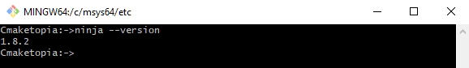

# Project Organization

## Project Structure

The most natural way of organizing c++ project is spreading source code into smaller parts. The modularity, code reuse, and separation of concerns should be taken into account while dividing the code into logical parts. Common tasks can be grouped into functions and classes. They based on code reuse can be joined into file. Files predicated on separation of concerns can create a library. Libraries should be spread across different subdirectories in the source tree. Each executable should be placed in a different subdirectory also. This practice helps organizing code within a project. Because each library and executable can be build separately it simplifies and speeds up recompilation of a project during development. The source tree creates a hierarchy thus we call this source organization hierarchical project. We have a master directory and a directory for each library and executable. We are Cmaketopians thus we leverage a GitHub repository to backup and share our ideas. So, in addition to the code, our repository should have the appropriate structure and files.  
In this part of the tutorial we'll develop a project SophisticatedMath.  We will do it in a three-person team. Each member of the team will use a different type of IDE, Visual Studio, Vs Code, QT Creator respectably. We'll be utilize IDE only for writing code. We'll compile source code outside of the IDE manually. Our task will be to create two executable and two libraries, one static and one dynamic. A master directory name of project is SophisticatedMath. Each logical part of source code should be located in its own subdirectory. One application will count area of figures and the other perimeters. Binaries will be placed in a folder named "build" inside of a project directory. GitHub repository should only contains source code, a license, a readme file and documentation of project. Because we have common repository for our tutorial we'll place SophisticatedMath directory in src/Level05 folder. In a typical repository the project directory is located in src folder. Let's do it!
The project is still under construction, so stay tuned.:smile:

## Build system

As cross-platform programmers we need a simple build system which we can leverage on many platforms in the same way irrespective of IDE or toolchain we utilize. We use it to configure the build options and create the final applications or libraries from sources. That tasks developers have to repeat several times every day, so it is extremely important to ensure that the process is under control and repeatable. When the [build systems](https://en.wikipedia.org/wiki/List_of_build_automation_software) come into play we should be familiar with a notion of a [target](https://cmake.org/cmake/help/v3.13/manual/cmake-buildsystem.7.html). The build systems:construction_worker::construction_worker: organize files into targets. Each target corresponds to an executable or library, or is a custom target containing custom commands or actions the build tool must perform, such as installing an application. It's about time we need to get familiar with the main actors of our story. Ladies and gentlemen let me introduce a fantastic couple:couple: [Cmake](https://cmake.org/) and [Ninja](https://ninja-build.org/). As we may expect these are command line tools too. It means we need run they from a shell. [Run your shell](https://en.wikipedia.org/wiki/Shell_\(computing\)) such a bash on Unix , cmd.exe or Mingw64-w64 shell on Windows. Now an operating system is at our command.  
Type **cmake \-\-version** and press Enter.
  
Type **cmake \-\-help** don't forget about **enter**, now  **cmake \-\-help-command-list** and **cmake \-\-help-manual-list**. I feel we got the hang of the first tool.  
Now Ninja. Type **ninja \-\-version** and press Enter. See Ninja documentation for more details and try another command. All is under our control. We are not rabbits :rabbit::rabbit2: now.  
  

<!-- blank line -->
<figure class="video_container">
  <iframe src="https://www.youtube.com/embed/9jK-NcRmVcw" frameborder="0" allowfullscreen="true"> </iframe>
</figure>
<!-- blank line -->
